# Synesthetic Labs

Synesthetic Labs delivers the v0.1 generator → critic workflow with deterministic Python agents and a container harness that mirrors CI.

## Quickstart

```bash
# Build and test inside Docker
docker build -t synesthetic-labs:test .
docker run --rm synesthetic-labs:test

# or use the wrapper
./test.sh

# Local test suite without Docker
pytest -q
```

Run `python -m labs.cli --help` to explore the CLI:

* `python -m labs.cli generate "describe the asset"`
* `python -m labs.cli critique '{"id": "abc", ...}'`

Configure the STDIO MCP adapter by exporting `MCP_ADAPTER_CMD` (for example,
`python -m synesthetic_schemas.mcp`). Optional variables such as
`SYN_SCHEMAS_DIR` are forwarded to the subprocess. MCP validation is mandatory:
if the adapter command fails the CLI exits non-zero and records the failure in
the review payload. When validation succeeds, the CriticAgent records the MCP
response for provenance. `.env.example` documents the environment variables.

Generator and critic logs live under `meta/output/labs/`, and validated assets
persist to `meta/output/labs/experiments/` when generation succeeds. Modulation
and rule bundle generators are deferred to v0.2+.

## Further Reading

* `docs/labs_spec.md` — canonical scope for this release
* `AGENTS.md` — generator and critic provenance
* `meta/prompts/` — canonical prompt set and audit requests

```mermaid
flowchart TB
  subgraph Labs["Synesthetic Labs (v0.1)"]
    G["GeneratorAgent\n(propose, assemble, log)"]
    C["CriticAgent\n(review, enforce MCP, log)"]
    CLI["labs.cli\n(generate, critique,\npersist experiments)"]
  end

  MCP["MCP Adapter (STDIO bridge)\n• Accepts JSON-RPC over stdin/stdout\n• Runs schema validation\n• Forwards to backend if available"]
  SCHEMAS["synesthetic-schemas (SSOT)\n• JSON Schemas\n• Python bindings\n• Examples"]
  BACKEND["sdfk-backend\n• API + store\n• CRUD for assets"]

  G --> |"proposed assets"| C
  C --> |"validate via STDIO"| MCP
  CLI --> |"runs"| G
  CLI --> |"runs"| C

  MCP --> |"loads schemas"| SCHEMAS
  BACKEND --> |"loads schemas"| SCHEMAS
  MCP --> |"optional proxy"| BACKEND

  style Labs fill:#222222,stroke:#ffffff,stroke-width:2px
  style MCP fill:#333333,stroke:#ffffff,stroke-width:2px
  style SCHEMAS fill:#444444,stroke:#ffffff,stroke-width:2px
  style BACKEND fill:#666666,stroke:#ffffff,stroke-width:2px

```



