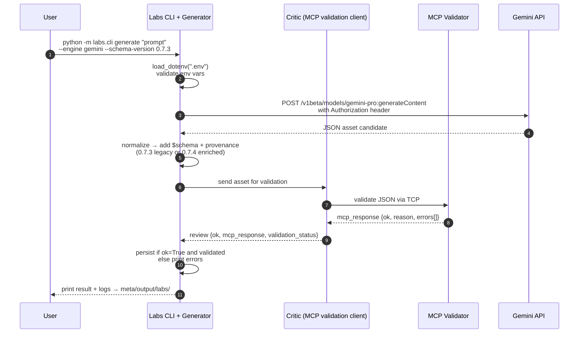

# Synesthetic Labs

Synesthetic Labs delivers the v0.3 generator → critic workflow with deterministic Python agents, optional Gemini/OpenAI engines, Unix socket + TCP MCP transports, and a patch lifecycle stub exercised via the CLI.

```mermaid
flowchart LR
  subgraph Local["Local Runtime"]
    CLI["CLI (labs/cli.py)"]
    GEN["Generator (AssetAssembler + External engines)"]
    CRIT["Critic (labs/agents/critic.py)"]
  end

  subgraph External["External Systems"]
    subgraph ENG["External Engines"]
      GEMINI["Gemini API"]
      OPENAI["OpenAI API"]
    end
    MCP["MCP Adapter (synesthetic-mcp)"]
    SCHEMAS["Schemas (synesthetic-schemas)"]
  end

  CLI --> GEN
  GEN --> CRIT
  GEN -->|if LABS_EXTERNAL_LIVE=1| ENG
  ENG -->|live API call| GEN
  CRIT -->|validate| MCP
  MCP -->|imports| SCHEMAS
  MCP -->|mcp_response| CRIT
  CRIT -->|review + ok/fail| CLI

  style Local fill:#1b1b1b,stroke:#fff,stroke-width:2px
  style External fill:#262626,stroke:#ccc,stroke-width:1.5px
  style ENG fill:#222,stroke:#888,stroke-width:1px
  style GEMINI fill:#1a3d6d,stroke:#9cf,stroke-width:1.5px
  style OPENAI fill:#3d1a6d,stroke:#c9f,stroke-width:1.5px
```



## Quickstart

```bash
# Build and test inside Docker
docker build -t synesthetic-labs:test .
docker run --rm synesthetic-labs:test

# or use the wrapper
./test.sh

# Local test suite without Docker
pytest -q
```

Run `python -m labs.cli --help` to explore the CLI:

* `python -m labs.cli generate "describe the asset"`
* `python -m labs.cli generate --engine deterministic "prompt"`
* `python -m labs.cli generate --engine gemini "external prompt"`
* `python -m labs.cli critique '{"asset_id": "abc", ...}'`
* `python -m labs.cli preview '{"asset_id": "asset"}' '{"id": "patch", "updates": {...}}'`
* `python -m labs.cli apply '{"asset_id": "asset"}' '{"id": "patch", "updates": {...}}'`
* `python -m labs.cli rate patch-id '{"score": 0.9}' --asset-id asset-id`

Use `--engine deterministic` to explicitly route generation through the local `AssetAssembler`; omitting `--engine` behaves the same way.

Configure the MCP adapter transport using environment variables:

```bash
# TCP transport (default when MCP_ENDPOINT is unset)
export MCP_HOST=127.0.0.1
export MCP_PORT=8765

# STDIO transport
export MCP_ENDPOINT=stdio
export MCP_ADAPTER_CMD="python -m labs.mcp_stub"

# Unix socket transport
export MCP_ENDPOINT=socket
export MCP_SOCKET_PATH="/tmp/synesthetic.sock"
python -m labs.mcp --path "$MCP_SOCKET_PATH"  # launches the bundled adapter once
```

If `MCP_ENDPOINT` is unset or set to an unsupported value, Labs automatically falls back to the TCP transport so validation can still run with the host/port defaults.

All assets emitted by the generator and accepted by the MCP validator are
required to include a top-level `$schema` field that points at the bundled
`meta/schemas/synesthetic-asset.schema.json`. Validator responses surface a
`validation_failed` error on `/$schema` when the field is missing or when the
legacy `$schemaRef` value is provided.

Optional variables such as the (deprecated, STDIO-only) `SYN_SCHEMAS_DIR`,
`LABS_EXPERIMENTS_DIR`, and `LABS_FAIL_FAST` tune validation and persistence
behavior. `LABS_FAIL_FAST`
defaults to strict (`1`) so CLI and experiment runs fail when the MCP adapter
is unavailable; set it to `0`/`false` to downgrade MCP issues to warnings while
still attempting validation. The transport helpers enforce a 1 MiB payload cap and
`normalize_resource_path` rejects path traversal in schema or socket
configurations. When the patch lifecycle commands run, the critic logs patch
reviews and rating stubs to `meta/output/labs/critic.jsonl` while the patch
module appends lifecycle events to `meta/output/labs/patches.jsonl`.

### Schema version targeting

- The generator defaults to the `0.7.3` schema corpus, keeping legacy clients
  compatible without additional flags.
- Override the target schema by passing `--schema-version` to `labs generate`
  or defining `LABS_SCHEMA_VERSION`. Precedence: CLI flag → environment variable
  → default (`0.7.3`).
- Schema-aware branching emits legacy payloads for `0.7.3` and enriched assets
  for `0.7.4+`, always tagging `$schema` with the hosted corpus URL.

Unix socket validation is optional in CI; set `LABS_SOCKET_TESTS=1` locally to
enable the socket transport tests.

```text
+-------------+      STDIO / Socket JSON      +----------------------+      Schema bundle / backend
| Labs (CLI & | ============================> | MCP Adapter (STDIO) | ===========================>
| Experiments)| <============================ |    or socket mode    |
+-------------+                               +----------------------+
```

Generator and critic logs live under `meta/output/labs/`, and validated assets
persist to `meta/output/labs/experiments/` when generation succeeds.

## External engines (v0.3.4)

External generators reuse the critic + MCP validation path and now support live API calls with provenance-rich logging.

```bash
# Mocked (default) Gemini run
python -m labs.cli generate --engine gemini "chromatic tides"

# Enable live mode with env-configured API keys
export LABS_EXTERNAL_LIVE=1
export OPENAI_API_KEY=sk-...
python -m labs.cli generate --engine openai \
  --seed 42 --temperature 0.7 --timeout-s 20 --relaxed "spectral chorus"
```




## Highlights:

- `labs/generator/external.py` loads provider credentials from env, injects `Authorization` headers in live mode, enforces 256 KiB/1 MiB size caps, and retries with exponential backoff based on the spec taxonomy.
- Every run appends a JSONL entry under `meta/output/labs/external.jsonl` capturing the trace ID, transport, strict flag, redacted request headers, raw response hash/size, normalized asset, and MCP validation result.
- Live runs require `LABS_EXTERNAL_LIVE=1` plus provider keys (`GEMINI_API_KEY`, `OPENAI_API_KEY`); keys are redacted in logs and provenance metadata is written under `asset.meta_info.provenance`.
- The CLI exposes `--seed`, `--temperature`, `--timeout-s`, and `--strict/--relaxed` flags so operators can control determinism, request budgets, and fail-fast behaviour.
- See `docs/troubleshooting_external.md` for error taxonomy hints (`auth_error`, `rate_limited`, `timeout`, `bad_response`, `server_error`, `network_error`).


## Further Reading

* `docs/labs_spec.md` — canonical scope for this release
* `AGENTS.md` — generator and critic provenance
* `meta/prompts/` — canonical prompt set and audit requests
