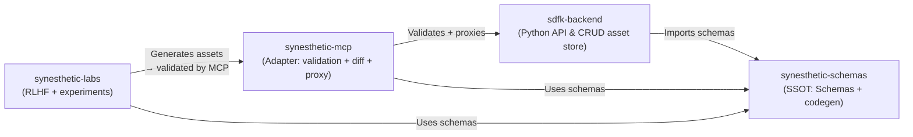

# synesthetic-labs

Experimental lab environment for **Synesthetic System** research:
asset generation, patch lifecycle, and reinforcement learning with human feedback (RLHF).

---

## Purpose

This repo is the experimental playground for features that don’t belong in the core stack but are critical for evolving the **Synesthetic Engine**:

* **Asset generation pipelines** (shaders, tones, haptics, multimodal compositions).
* **Patch lifecycle orchestration**: propose → validate → rate → persist.
* **RLHF loops** with agents that generate, critique, and score.
* **Dataset management** for training and evaluation.
* **Integration hooks** to use the MCP adapter for validation before persistence.

MCP and backend remain focused on *validation + persistence*.
Labs is where new methods, experiments, and pipelines are developed.

---

## Relationship to Other Repos



---

## Planned Features

* **Agent pipelines** for proposing and rating patches.
* **Patch lifecycle management** with JSON Patch (RFC 6902).
* **Dataset building** for training and evaluation of multimodal assets.
* **CLI tools** for generator → critic → scorer loops.
* **Structured logging** and replay for reproducible experiments.
* **Tight integration with MCP** for schema validation before backend persistence.

---

## Repo Layout (planned)

```text
synesthetic-labs/
├── labs/                 # Core lab modules
│   ├── agents/           # Generator, critic, scorer agents
│   ├── lifecycle/        # Patch lifecycle orchestration
│   ├── datasets/         # Dataset management and replay
│   └── __init__.py
│
├── tests/                # Pytest-based unit/integration tests
│   ├── test_agents.py
│   ├── test_lifecycle.py
│   └── test_datasets.py
│
├── meta/
│   ├── prompts/          # Canonical Codex/LLM prompts
│   ├── output/           # Audit + experiment reports
│   └── README.md
│
├── requirements.txt      # Runtime/test deps (pinned)
├── Dockerfile            # Containerized runtime
├── docker-compose.yml    # Local/CI harness
├── test.sh               # Build + run tests inside container
├── README.md             # (this file)
└── .github/workflows/    # CI configs (pytest, lint, RLHF harnesses)
```

---

## Getting Started

### Local (direct)

```bash
git clone https://github.com/yourorg/synesthetic-labs
cd synesthetic-labs

# Install dependencies (TBD — likely mirrors backend dev flow)
pip install -r requirements.txt

# Run the lab CLI (placeholder)
python -m labs.cli --help
```

### Containerized

```bash
# Build container
docker compose build

# Run tests in container
./test.sh
```

Containerization is the default path for reproducible experiments.
Local installs are supported for rapid iteration, but CI always runs in Docker.

---

## Status

⚠️ **Early stage** — repo structure and interfaces are subject to change.
This repo is the right place to experiment with RLHF-driven asset generation and patch lifecycle workflows. Core validation and persistence still live in `synesthetic-mcp` and `sdfk-backend`.

