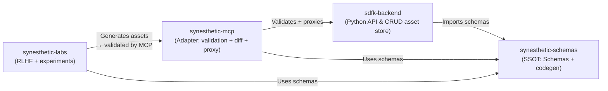

# synesthetic-labs

Experimental lab environment for **Synesthetic System** research: asset generation, patch lifecycle, and reinforcement learning with human feedback (RLHF).

## Purpose

Labs hosts experiments that complement the core **Synesthetic Engine** while MCP and the backend stay focused on validation and persistence.

## Relationship to Other Repos



## Repo Layout (planned)
```text
synesthetic-labs/
├── labs/                 # Core lab modules
│   ├── agents/           # Generator, critic, scorer agents
│   ├── lifecycle/        # Patch lifecycle orchestration
│   ├── datasets/         # Dataset management and replay
│   └── __init__.py
│
├── tests/                # Pytest-based unit/integration tests
│   ├── test_agents.py
│   ├── test_lifecycle.py
│   └── test_datasets.py
│
├── meta/
│   ├── prompts/          # Canonical Codex/LLM prompts
│   ├── output/           # Audit + experiment reports
│   └── README.md
│
├── requirements.txt      # Runtime/test deps (pinned)
├── Dockerfile            # Containerized runtime
├── docker-compose.yml    # Local/CI harness
├── test.sh               # Build + run tests inside container
├── README.md             # (this file)
└── .github/workflows/    # CI configs (pytest, lint, RLHF harnesses)
```

## Getting Started

### Local (direct)

```bash
git clone https://github.com/yourorg/synesthetic-labs
cd synesthetic-labs

# Install dependencies (TBD — likely mirrors backend dev flow)
pip install -r requirements.txt

# Run the lab CLI (placeholder)
python -m labs.cli --help
```

### Containerized

```bash
# Build container
docker compose build

# Run tests in container
./test.sh
```

Containerization is the default path for reproducible experiments. Local installs are supported for rapid iteration, but CI always runs in Docker.

See `docs/labs_spec.md` for the v0.1 generator + critic details.
